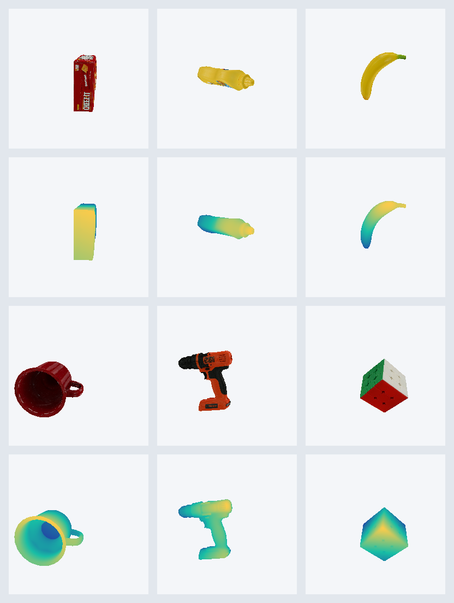

# bevy-sensor

A Rust library and CLI for capturing multi-view images (RGBA + Depth) of 3D objects, specifically designed for the [Thousand Brains Project](https://github.com/thousandbrainsproject/tbp.monty) sensor simulation.

This crate serves as the visual sensor module for the [neocortx](https://github.com/killerapp/neocortx) project, providing TBP-compatible sensor data (64x64 resolution, specific camera intrinsics) from YCB dataset models.

This crate is intentionally narrow in scope: it exists to support TBP-compatible capture workflows, with NeoCortx as the primary downstream consumer. Public API changes should favor practical downstream utility over broad generalization.

## Features

- **TBP-Compatible:** Matches Habitat sensor specifications (resolution, coordinate systems).
- **Multi-View:** Captures objects from spherical viewpoints (yaw/pitch).
- **YCB Integration:** Auto-downloads and caches [YCB Benchmark](https://www.ycbbenchmarks.com/) models.
- **Headless:** Optimized for headless rendering on Linux and WSL2 (via WebGPU).

## Visual Showcase



The gallery above is generated by `examples/readme_showcase.rs` from real YCB
meshes and textures. It mixes TBP/YCB staples (`003_cracker_box`,
`006_mustard_bottle`, `011_banana`) with familiar non-standard YCB objects
(`025_mug`, `035_power_drill`, `077_rubiks_cube`) so researchers can see both
the RGB artifact and the depth signal that downstream sensorimotor code consumes.

Regenerate it locally:

```bash
cargo run --example readme_showcase --release -- --data-dir /tmp/ycb --output-dir docs/images
```

Any object with the standard YCB/ycbust layout can be rendered the same way:
`<object_id>/google_16k/textured.obj` plus `texture_map.png`. Use
`RenderConfig::preview()` for README-quality visuals, or
`RenderConfig::tbp_default()` for the 64x64 TBP-compatible capture path.

## Requirements

- **Rust:** 1.82+ (Bevy 0.15 MSRV)
- **Bevy:** 0.15+
- **System:** Linux with Vulkan drivers (or WSL2).
- **Tools:** `just` (recommended command runner).

## Quick Start

1.  **Install Just** (Optional but recommended):
    ```bash
    cargo install just
    ```

2.  **Run a Test Render:**
    ```bash
    just render-single 003_cracker_box
    # Models will be automatically downloaded to /tmp/ycb if missing.
    # To use a custom location: cargo run --bin prerender -- --data-dir ./my_models ...
    # Output saved to test_fixtures/renders/
    ```

    On memory-constrained Windows machines, build once before running large
    benchmarks and limit Cargo parallelism:
    ```powershell
    $env:CARGO_BUILD_JOBS = "1"
    cargo build --bin prerender
    just render-tbp-benchmark
    ```

## Usage

### CLI (Batch Rendering)

Render the standard TBP benchmark set (10 objects):
```bash
just render-tbp-benchmark
```

Render specific objects:
```bash
just render-batch "003_cracker_box,005_tomato_soup_can"
```

Validate center foreground hits before a longer NeoCortx parity run:
```bash
cargo run --bin prerender -- \
  --validate-center-hit \
  --data-dir /tmp/ycb \
  --objects "033_spatula,057_racquetball,063-b_marbles,065-e_cups,073-f_lego_duplo" \
  --target mesh-center \
  --rotation-schedule tbp-parity \
  --validation-report target/center_hit_validation_timeout_objects.json
```

The validation command exits non-zero when any object rotation has zero center-foreground hits.
Batch prerenders also accept `--target mesh-center` and write the targeting policy,
mesh bounds, target point, camera pose, and render-health summary into the generated
manifest/index JSON.

### Library (Rust)

Add to your `Cargo.toml`:
```toml
[dependencies]
bevy-sensor = "0.4"
```

Use in your code:
```rust
use bevy_sensor::{render_to_buffer, RenderConfig, ViewpointConfig, ObjectRotation};
use std::path::Path;

fn main() -> Result<(), Box<dyn std::error::Error>> {
    // 1. Configure
    let config = RenderConfig::tbp_default(); // 64x64, TBP intrinsics
    let viewpoint = bevy_sensor::generate_viewpoints(&ViewpointConfig::default())[0];
    let rotation = ObjectRotation::identity();
    let object_path = Path::new("/tmp/ycb/003_cracker_box");

    // 2. Render to memory (RGBA + Depth)
    let output = render_to_buffer(object_path, &viewpoint, &rotation, &config)?;
    
    println!("Captured {}x{} image", output.width, output.height);
    Ok(())
}
```

For YCB parity runs where the mesh's visual center is not the source origin,
generate the same TBP orbit around the rotated mesh AABB center:

```rust
use bevy_sensor::{
    generate_ycb_object_centered_viewpoints, render_to_buffer, ObjectRotation, RenderConfig,
    ViewpointConfig,
};
use std::path::Path;

fn render_centered() -> Result<(), Box<dyn std::error::Error>> {
    let object_path = Path::new("/tmp/ycb/033_spatula");
    let config = RenderConfig::tbp_default();
    let rotation = ObjectRotation::new(0.0, 90.0, 0.0);
    let viewpoints = generate_ycb_object_centered_viewpoints(
        object_path,
        &ViewpointConfig::default(),
        &rotation,
    )?;
    let output = render_to_buffer(object_path, &viewpoints[0], &rotation, &config)?;

    let health = output.health();
    let surface_point = output.center_surface_point_world();
    println!("{:?} {:?}", health.center_foreground, surface_point);
    Ok(())
}
```

### YCB Helpers

The public `ycb` module is the supported downstream surface for dataset selection and retrieval:

```rust
use bevy_sensor::ycb::{download_objects, REPRESENTATIVE_OBJECTS, TBP_STANDARD_OBJECTS};

fn plan_downloads() {
    assert_eq!(REPRESENTATIVE_OBJECTS.len(), 3);
    assert_eq!(TBP_STANDARD_OBJECTS.len(), 10);

    let future = download_objects("/tmp/ycb", &["003_cracker_box"]);
    drop(future);
}
```

NeoCortx binds to this YCB helper surface directly. If it changes, release the crate promptly so downstream builds move forward on published versions instead of long-lived local patches.

## Troubleshooting

### WSL2 Support
WSL2 does not support native Vulkan window surfaces well. This project defaults to the **WebGPU** backend on WSL2, which works reliably for headless rendering.
*   **Fix:** Ensure you have up-to-date GPU drivers on Windows.

### Software Rendering (No GPU)
If you absolutely have no GPU, you can try software rendering (slow, potential artifacts):
```bash
LIBGL_ALWAYS_SOFTWARE=1 GALLIUM_DRIVER=llvmpipe cargo run --release
```

The library uses true headless rendering with `RenderTarget::Image` - no display or window surface required.

## Development Posture

- Prefer fixes in the owning repo: renderer and sensor issues belong here, YCB download/layout issues belong in `ycbust`.
- Local path dependencies are fine during fast iteration, but stable downstream integrations should move back to released versions.
- Throughput and Rust-native efficiency matter because this crate sits on NeoCortx's benchmark path.
## License

MIT
